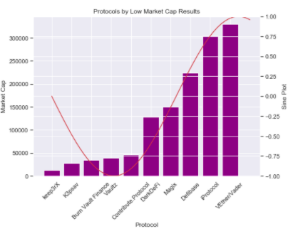

## Steady State Preliminary Exploit Analysis

The official Steady State (SST) data analysis notebook is a primal iteration of [multivariate statistical analysis](https://github.com/steadystatedefi) conducted by the SST software development team.

## Risk Analysis Database -- Open source 

The Risk Analysis Database(RAD) hosts a dynamic collection of granular data in exploits/hacks in the decentralized finance industry. The granularity is represented in the exploit metadata we capture such as block ids, contract hashes, and hacker public addresses.

Columns are data values. Within the RAD, the data values to be analyzed are the following: Date of Exploit, Market Cap, TVL, and ETH gas used. Quantitative data guides the risk assessment process as we determine risk using those factors.

## Market Cap Relevance
The following notebook has a parochial focus on the impact of the ($) dollar value of DeFi protocols' market cap and the nature of the exploit. In conclusion, we have gathered that protocols with low market caps during exploits tend to be orchestrated rug pulls. 

#### 📉  Analyzing Protocols with Low Market Caps
Coalitions of token holders participate in ["pump and dump"](https://www.investopedia.com/terms/p/pumpanddump.asp) schemes meaning new token holders are invited to pump the price of the coin while old token holders immediately dump their tokens for profit. Protocols with high market caps have much more variance in exploit behavior. 

<!-- image -->

  

#### 📈  Analyzing Protocols with High Market Caps
Protocols with high market caps tend to be subject to smart contract exploits and flash loan attacks. Smart contract exploits have resulted in over $500 million (USD) over the past 4 years in the DeFi industry. Market Cap at the time of exploits/hacks do in fact have relevance.
